<p align="center">
  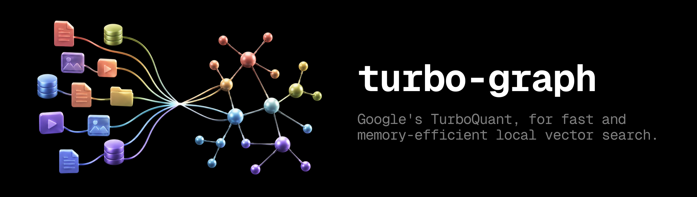
</p>

<p align="center">
  <a href="https://github.com/bigmacfive/turbo-graph/blob/main/LICENSE"></a>
  <a href="README.md"></a>
  <a href="README.ko.md"></a>
  <a href="https://github.com/RyanCodrai/turbovec"></a>
  <a href="docs/README.ko.md"></a>
</p>

# turbo-graph

**turbovec 호환 TurboQuant 코어에, 제약이 많은 RAG를 위한 production graph memory를 더한 프로젝트입니다.**

[turbovec](https://github.com/RyanCodrai/turbovec)는 임베딩을 좌표당 2–4bit로 압축하고, 별도 train 없이 벡터를 넣으며, SIMD 커널로 검색합니다. **turbo-graph는 이 계보를 유지하면서 RAG에서 어려운 부분을 index 안으로 옮깁니다** — 가중치 그래프, tag/source/time 뷰, 캐시된 `SlotMask`, 그래프 rerank, Python graph memory, 쿼리 텔레메트리.

> **실무 기준:** 제약 자체가 제품이면 **turbo-graph**입니다. 의미 유사도에 tenant/tag/source/time/그래프 이웃/설명/캐시 재사용이 붙는 경로를 겨냥합니다. 코퍼스 전체에서 필터 없이 top-k만 필요하면 **turbovec만으로 충분**합니다.

**목차:** [turbovec과의 관계](#turbovec과의-관계) · [상세 비교](#turbovec-vs-turbo-graph-상세-비교) · [벤치마크](#벤치마크) · [설치](#설치) · [빠른 시작](#빠른-시작) · [문서](#문서)

---

## turbovec과의 관계

이 저장소는 turbovec 코드베이스의 **포크**입니다. TurboQuant 인코딩·검색, `.tv` / `.tvim`, Python API는 upstream과 같은 계열입니다.

<p align="center">
  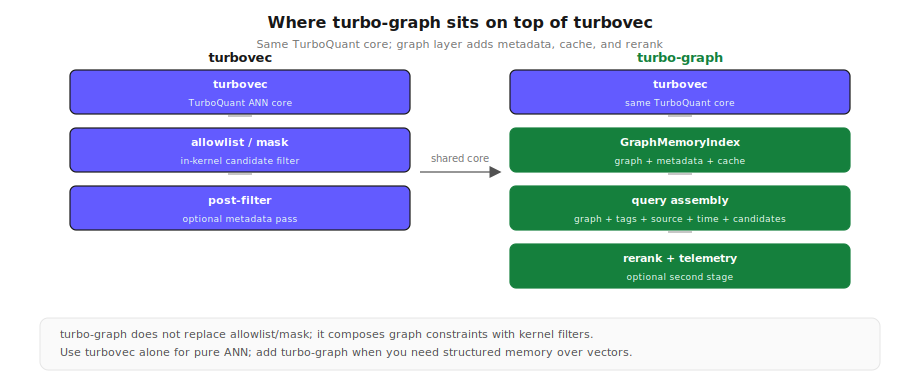
</p>

보라색 블록 = **그래프 레이어**(이 포크). 공유 violet 블록 = [turbovec](https://github.com/RyanCodrai/turbovec) **TurboQuant 코어**.

<details>
<summary>기능 비교 표 전체 보기</summary>

| 기능 | turbovec | turbo-graph |
|---|---|---|
| TurboQuant encode / search | ✅ | ✅ 동일 코어 |
| `TurboQuantIndex` / `IdMapIndex` | ✅ | ✅ 호환 API |
| 커널 `allowlist` / `mask` | ✅ v0.3~ | ✅ + `SlotMask` 캐시 |
| 그래프 이웃 확장 | — | ✅ |
| tag / source / time | SQL 직접 | ✅ 인덱스 + 캐시 |
| rerank + BM25 hybrid | — | ✅ |
| explain / telemetry | 일부 | ✅ |
| Python `GraphMemoryIndex` | — | ✅ 핵심 운영 API |
| 프레임워크 통합 | ✅ | ✅ |

</details>

---

## turbovec vs turbo-graph — 상세 비교

### turbovec이 이미 해결하는 것

upstream turbovec은 “벡터 검색 후 Python에서 필터” 같은 단순 구조가 **아닙니다**:

- **`IdMapIndex.search(..., allowlist=ids)`** — id 제한이 **SIMD 커널 안**에서 적용되고, 빈 32-vector block은 LUT 전에 건너뜁니다 ([#30](https://github.com/RyanCodrai/turbovec/issues/30)).
- **`TurboQuantIndex.search(..., mask=...)`** — slot 마스크도 동일.
- 결과는 `(nq, min(k, n_allowed))` — 패딩 없이, tight filter에서 recall을 살리려고 over-fetch하지 않아도 됩니다.
- train-free ingest, TQ+, RaBitQ 보정, ARM에서 FAISS FastScan 대비 우위 등은 여기서 그대로 물려받습니다.

turbo-graph는 **커널 필터를 대체하지 않습니다**. turbovec이 앱에 남기던 그래프·메타데이터 조합·캐시·rerank를 crate 안으로 옮긴 것입니다.

<p align="center">
  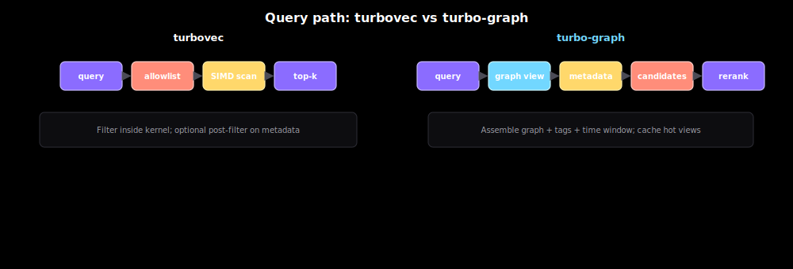
</p>

주황 = turbovec에서 앱이 하는 조립. indigo = turbo-graph가 한 번 컴파일해 재사용하는 뷰.

**요약:** 필터가 가볍거나 allowlist 구성이 싸면 turbovec. **`graph ∩ tag ∩ source ∩ time ∩ candidates`** 재조립이 매번 비싸고, cache hit/trace/rerank 제어가 필요하면 turbo-graph.

### 전환할까?

<p align="center">
  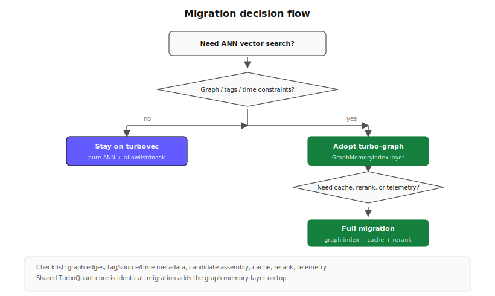
</p>

아래 **3개 이상 yes**:

1. 대부분의 쿼리에 tenant/source/tag/time이 붙는다.
2. vector search 전에 그래프 이웃을 확장한다.
3. 같은 필터가 burst로 반복된다.
4. BM25/SQL 점수를 vector·graph와 수동 merge한다.
5. trace/cache/selectivity 설명이 production에 필요하다.
6. `allowlist=`는 충분한데 **allowlist 구성**이 병목이다.

그렇지 않으면 turbovec 유지, 필터 무거운 경로만 turbo-graph.

```python
from turbovec import IdMapIndex      # upstream
from turbo_graph import IdMapIndex   # 이 repo — 코어 API 동일
```

전체 표·PR 체크리스트: [`docs/benchmark_turbo_graph_vs_turbo_vec.md`](docs/benchmark_turbo_graph_vs_turbo_vec.md)

---

## 벤치마크

수치 출처: `benchmarks/results/*.json`. 차트: `python3 benchmarks/create_diagrams.py`

**공통 설정 (코어):** DB 100K, query 1K, `k=64`, seed 42, L2 정규화.

### Recall vs FAISS IndexPQ

<p align="center">
  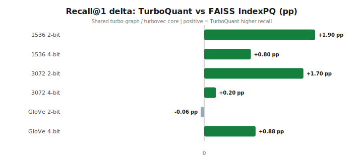
</p>

<p align="center">
  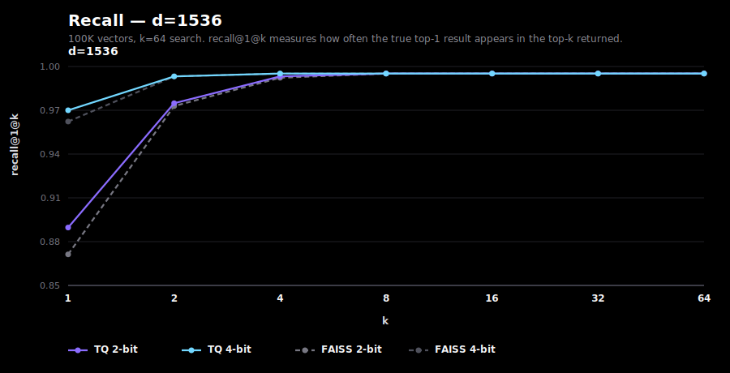
  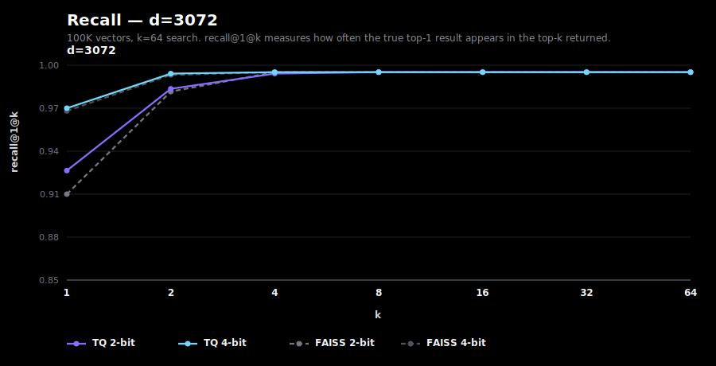
</p>

GloVe 2-bit만 FAISS가 +0.06pp 앞섬. k≈16부터 수렴. 원본: [`benchmarks/results/recall_*.json`](benchmarks/results/).

### Speed vs FAISS IndexPQFastScan

<p align="center">
  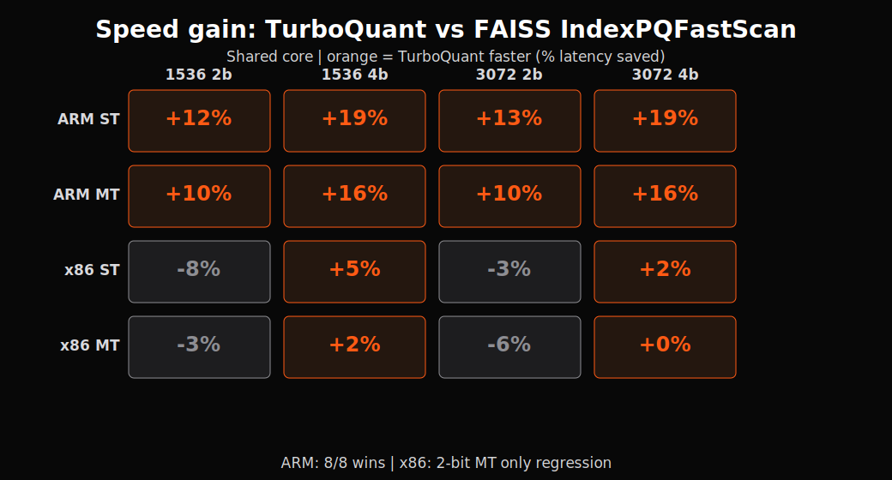
</p>

<p align="center">
  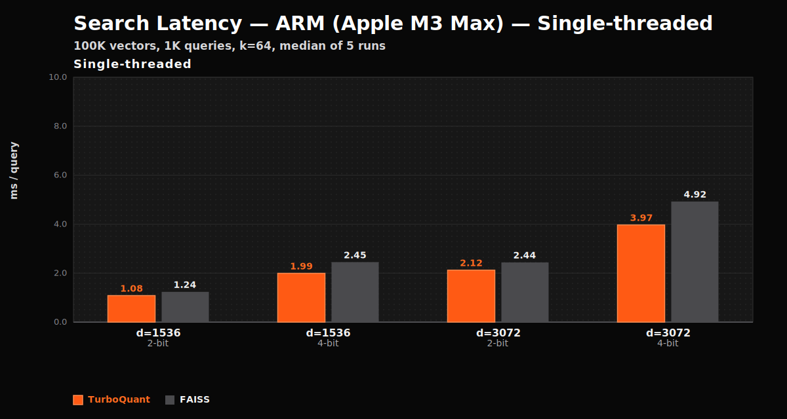
  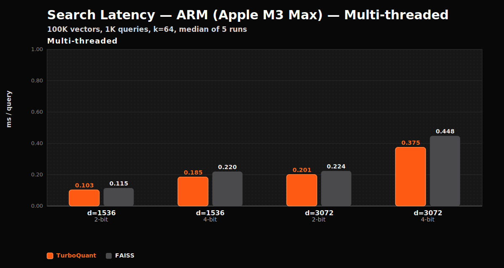
  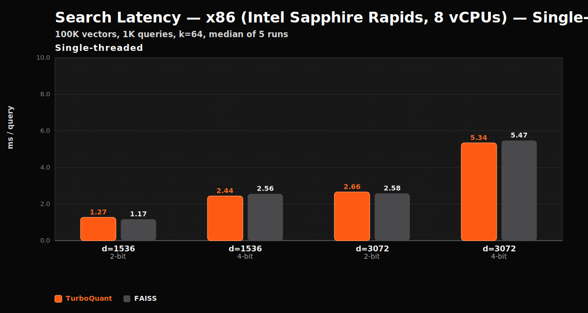
  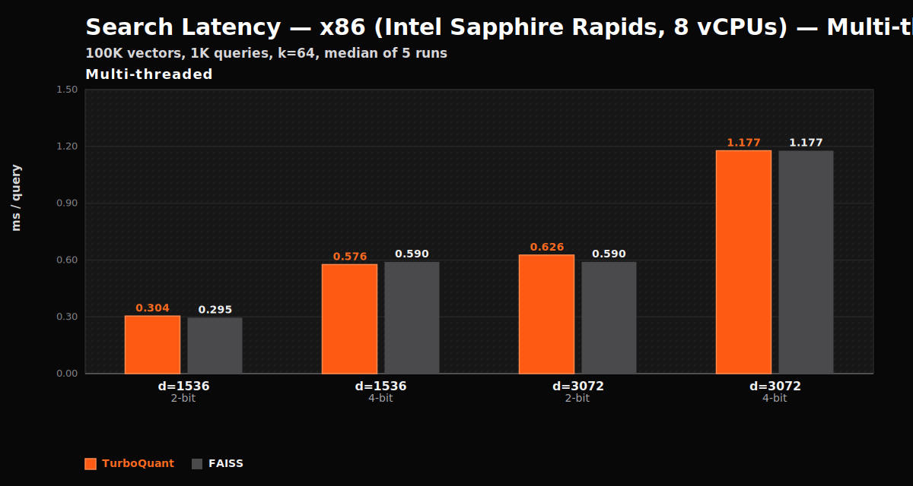
</p>

ARM 8/8 우위. x86 2-bit MT만 열세.

<details>
<summary>16개 speed 수치 전체 (ms/query)</summary>

| Dim | Bit | Arch | Thr | TQ | FAISS | Gain |
|---:|---:|---|---|---:|---:|---:|
| 1536 | 2 | ARM | ST | 1.083 | 1.235 | +12.3% |
| 1536 | 2 | ARM | MT | 0.103 | 0.115 | +10.4% |
| 1536 | 2 | x86 | ST | 1.271 | 1.172 | −8.4% |
| 1536 | 2 | x86 | MT | 0.304 | 0.295 | −3.1% |
| 1536 | 4 | ARM | ST | 1.992 | 2.450 | +18.7% |
| 1536 | 4 | ARM | MT | 0.185 | 0.220 | +15.9% |
| 1536 | 4 | x86 | ST | 2.439 | 2.560 | +4.7% |
| 1536 | 4 | x86 | MT | 0.576 | 0.590 | +2.4% |
| 3072 | 2 | ARM | ST | 2.124 | 2.439 | +12.9% |
| 3072 | 2 | ARM | MT | 0.201 | 0.224 | +10.3% |
| 3072 | 2 | x86 | ST | 2.657 | 2.582 | −2.9% |
| 3072 | 2 | x86 | MT | 0.626 | 0.590 | −6.1% |
| 3072 | 4 | ARM | ST | 3.968 | 4.925 | +19.4% |
| 3072 | 4 | ARM | MT | 0.375 | 0.448 | +16.3% |
| 3072 | 4 | x86 | ST | 5.342 | 5.474 | +2.4% |
| 3072 | 4 | x86 | MT | 1.177 | 1.177 | 0.0% |

</details>

### 압축 (100K)

<p align="center">
  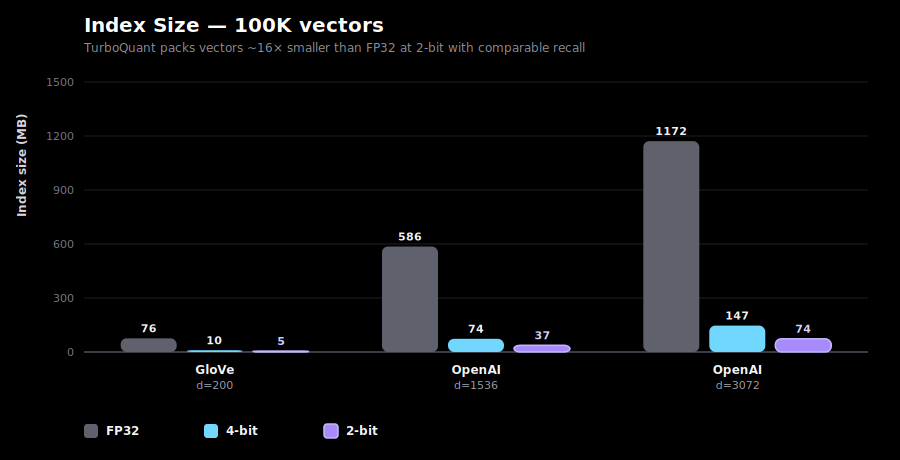
</p>

1536d × 1000만 × 2-bit ≈ **4 GB** (float32 ~31 GB).

### Graph 레이어

<p align="center">
  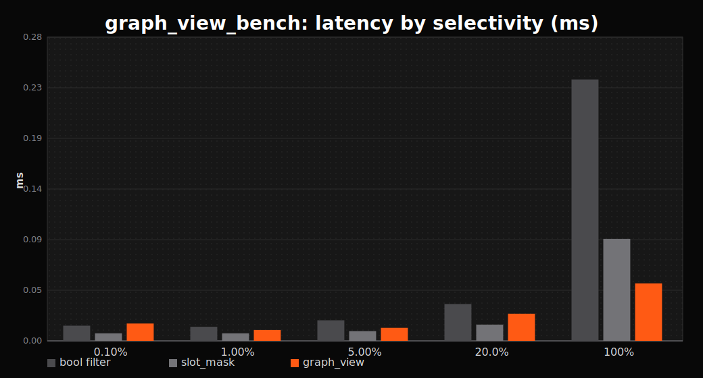
</p>

선택도가 낮으면 kernel `SlotMask`만으로 충분. **`graph ∩ metadata ∩ candidates` 컴파일·재사용**이 핵심 이득 지점.

**공통 한계:** brute-force O(n) (HNSW/IVF 아님), 2–4bit 근사, TQ+는 첫 add ≥1000 vector, 0.1.x는 Alpha 공개 라인 — production은 버전 고정.

---

## 설치

```bash
pip install turbo-graph   # 또는 turbo-graph-python/에서 maturin build
cargo add turbo-graph
```

Rust ≥ 1.70, `dim % 8 == 0`, `bit_width ∈ {2, 3, 4}`. x86_64는 AVX2 필요.

---

## 빠른 시작

### Python — turbovec 호환 코어

```python
import numpy as np
from turbo_graph import IdMapIndex

idx = IdMapIndex(dim=1536, bit_width=4)
idx.add_with_ids(vectors.astype(np.float32), ids.astype(np.uint64))

allowed = np.array([1003, 1010, 1042], dtype=np.uint64)
scores, hit_ids = idx.search(query.astype(np.float32), k=10, allowlist=allowed)
```

### Python — 제약형 RAG를 위한 graph memory

```python
import numpy as np
from turbo_graph import GraphMemoryIndex

memory = GraphMemoryIndex(dim=1536, bit_width=4)
memory.add_records(
    vectors.astype(np.float32),
    [
        {
            "id": 1001,
            "title": "Architecture note",
            "tags": ["architecture"],
            "source": "docs.example",
            "timestamp_ms": 1_700_000_000_000,
        },
        {
            "id": 1002,
            "title": "Retrieval cache note",
            "tags": ["architecture", "cache"],
            "source": "docs.example",
            "timestamp_ms": 1_700_000_010_000,
        }
    ],
)
memory.link_bidirectional(1001, 1002, 0.8)

hits = memory.search(
    query.astype(np.float32),
    k=10,
    seeds=[1001],
    required_tags=["architecture"],
    allowed_sources=["docs.example"],
    candidate_ids=[1001, 1002],  # 선택: BM25/SQL/ACL에서 온 후보 id.
)
batch_hits = memory.search_batch(
    batch_queries.astype(np.float32),
    k=10,
    seeds=[1001],
    required_tags=["architecture"],
    candidate_ids=[1001, 1002],
)
report = memory.explain(
    query.astype(np.float32),
    k=10,
    seeds=[1001],
    candidate_ids=[1001, 1002, 999],
)
```

실행 가능한 전체 Python workflow는
[`turbo-graph-python/examples/graph_memory_rag.py`](turbo-graph-python/examples/graph_memory_rag.py)를 참고하세요.

### Rust — 그래프 레이어

```rust
use turbo_graph::{GraphMemoryIndex, GraphSearchPreset, MemoryRecord, TurboQuantIndex};

let mut index = TurboQuantIndex::new(1536, 4)?;
index.add(&vectors);
index.prepare();

let mut memory = GraphMemoryIndex::new(1536, 4)?;
memory.add_records(
    &flat_vectors,
    vec![MemoryRecord::new(1001, "Architecture note", ["architecture"])
        .with_source("docs.example")
        .with_timestamp_ms(1_700_000_000_000)],
)?;

let report = memory.explain_graph_search_with_preset(
    &query, 10, &[1001], GraphSearchPreset::balanced(),
    &["architecture"], &["docs.example"],
    Some(1_700_000_000_000), None,
);
```

Graph API는 Rust가 가장 깊고, Python에서는 add/link/search/explain/cache/persist 중심의 핵심 운영 표면을 제공합니다.

---

## 벤치 실행

```bash
python3 benchmarks/download_data.py all
python3 benchmarks/suite/recall_d1536_2bit.py
python3 benchmarks/suite/speed_d1536_2bit_arm_mt.py

cargo run -p turbo-graph --release --example graph_view_bench -- --iters 3 --csv /tmp/graph-view-bench.csv
cargo run -p turbo-graph --release --example graph_view_bench_summary -- /tmp/graph-view-bench.csv
```

---

## 문서

```
docs/
├── README.ko.md ............ 문서 목록 (한국어)
├── api.md .................. API 레퍼런스
├── graph_memory_layer.md ... GraphMemory · SlotMask · preset
├── benchmark_turbo_graph_vs_turbo_vec.md
└── integrations/ ........... LangChain · LlamaIndex · Haystack · Agno
```

→ [**문서 목록**](docs/README.ko.md) · [API](docs/api.md) · [Graph layer](docs/graph_memory_layer.md) · [vs turbovec](docs/benchmark_turbo_graph_vs_turbo_vec.md)

---

## 오픈소스 운영

- [기여 가이드](CONTRIBUTING.md) — issue/PR 흐름, 테스트 게이트, 벤치마크 기준.
- [변경 기록](CHANGELOG.md) — 공개 `0.1.0` 릴리스 노트와 pre-0.1 개발 히스토리.
- [보안 정책](SECURITY.md) — 지원 버전과 취약점 제보 방식.

---

## 참고

- [TurboQuant (ICLR 2026)](https://arxiv.org/abs/2504.19874)
- [turbovec upstream](https://github.com/RyanCodrai/turbovec)
- [RaBitQ](https://arxiv.org/abs/2405.12497)

## 라이선스

MIT — [LICENSE](LICENSE). 코어는 turbovec 계보, 그래프 레이어는 이 포크의 추가 작업.
